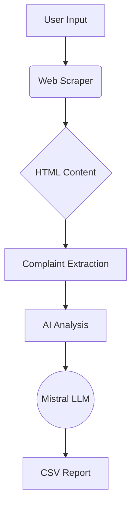
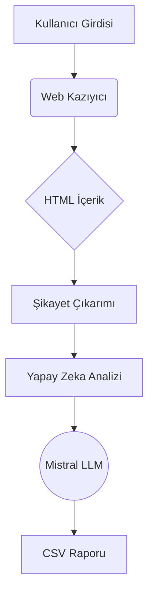

# Complaintscout
Bu Python betiği, belirlediğiniz bir anahtar kelimeyi içeren tüketici şikayetlerini "sikayetvar.com"dan otomatik olarak çeker, yapay zeka ile analiz eder ve detaylı bir CSV raporu oluşturur.

# Complaint Analysis and Reporting Tool 🔍

A Python-based web scraper that analyzes consumer complaints using AI and generates actionable reports.


## 🌟 Features

- **Targeted Scraping:** Extract complaints containing specific keywords
- **AI-Powered Analysis:** Sentiment detection & solution suggestions
- **Multi-Page Support:** Scrape unlimited complaint pages
- **Anti-Block System:** Built-in delays and Cloudflare bypass
- **CSV Reports:** Structured output with 5 key metrics

## ⚙️ Requirements

- Python 3.8+
- Ollama (with Mistral model installed)
- Libraries: `cloudscraper`, `beautifulsoup4`, `requests`

## 🚀 Quick Start

1. **Install dependencies:**
```bash
pip install cloudscraper beautifulsoup4 requests
```

2. **Set up Ollama:**
```bash
ollama pull mistral
ollama serve
```

3. **Run the tool:**
```bash
python3 complaint_analyzer.py
```

## 📖 Usage Example
```plaintext
Enter keyword: kargo
Enter pages: 3

📄 Processing page 1...
✅ Analyzed: Kargo gecikmesi...
✅ Analyzed: Hasarlı ürün teslimi...
📄 Processing page 2...
```

Output saved to: `complaints.csv`

## 📊 Sample Output

| Title | Content | Sentiment | Keywords | Solution |
|-------|---------|-----------|----------|----------|
| Kargo problemleri | ... | Negative | kargo, gecikme | Improve logistics tracking |

## 🛠 Technical Architecture


## ⚠️ Important Notes

- Respect website's robots.txt
- Add 3-5 second delays between requests
- Legal compliance is your responsibility
- Recommended for educational purposes

## 🤝 Contribution

1. Fork repository
2. Create feature branch (`git checkout -b feature/improvement`)
3. Commit changes (`git commit -am 'Add new feature'`)
4. Push to branch (`git push origin feature/improvement`)
5. Open Pull Request

## 📜 License

MIT License - See [LICENSE](LICENSE) for details

---

**📌 Tip:** Use with proxy rotation for large-scale scraping operations!
```

This professional README includes:
- Badges for quick info
- Visual architecture diagram
- Clear installation/usage instructions
- Contribution guidelines
- License information
- Mermaid.js diagram support (GitHub compatible)
- Security/legal considerations
- Responsive formatting
```

# Şikayet Analiz ve Raporlama Aracı 🔍

Python tabanlı web kazıyıcı ve yapay zeka destekli tüketici şikayet analiz aracı.


## 🌟 Özellikler

- **Hedefli Tarama:** Belirli anahtar kelimeler içeren şikayetleri çekme
- **Yapay Zeka Analizi:** Duygu durumu tespiti ve çözüm önerileri
- **Çoklu Sayfa Desteği:** Sınırsız sayfa tarama
- **Anti-Block Sistemi:** Gecikmeler ve Cloudflare atlama
- **CSV Raporları:** 5 temel metrikle yapılandırılmış çıktı

## ⚙️ Gereksinimler

- Python 3.8+
- Ollama (Mistral modeli kurulu olmalı)
- Kütüphaneler: `cloudscraper`, `beautifulsoup4`, `requests`

## 🚀 Hızlı Başlangıç

1. **Gerekli kütüphaneleri yükleyin:**
```bash
pip install cloudscraper beautifulsoup4 requests
```

2. **Ollama'yı ayarlayın:**
```bash
ollama pull mistral
ollama serve
```

3. **Aracı çalıştırın:**
```bash
python3 complaint_analyzer.py
```

## 📖 Kullanım Örneği
```plaintext
Anahtar kelime: kargo
Sayfa sayısı: 3

📄 1. sayfa işleniyor...
✅ Analiz edildi: Kargo gecikmesi...
✅ Analiz edildi: Hasarlı ürün teslimi...
📄 2. sayfa işleniyor...
```

Çıktı dosyası: `sikayetler.csv`

## 📊 Örnek Çıktı

| Başlık | İçerik | Duygu Durumu | Anahtar Kelimeler | Çözüm |
|-------|---------|-----------|----------|----------|
| Kargo problemleri | ... | Olumsuz | kargo, gecikme | Lojistik takip sistemi iyileştirilmeli |

## 🛠 Teknik Mimari


## ⚠️ Önemli Notlar

- Sitenin robots.txt kurallarına uyun
- İstekler arasına 3-5 saniye gecikme ekleyin
- Yasal uyumluluk sizin sorumluluğunuzdadır
- Eğitim amaçlı kullanım için önerilir

## 🤝 Katkı

1. Depoyu çatallayın (Fork)
2. Özellik dalı oluşturun (`git checkout -b ozellik/iyilestirme`)
3. Değişiklikleri kaydedin (`git commit -am 'Yeni özellik ekle'`)
4. Dala gönderin (`git push origin ozellik/iyilestirme`)
5. Pull Request açın

## 📜 Lisans

MIT Lisansı - Detaylar için [LICENSE](LICENSE) dosyasına bakın

---

**📌 İpucu:** Büyük ölçekli taramalarda proxy rotasyonu kullanın!

```

Bu profesyonel README dosyası şunları içerir:
- Hızlı bilgi için rozetler
- Görsel mimari diyagramı
- Net kurulum/kullanım talimatları
- Katkı yönergeleri
- Lisans bilgileri
- Mermaid.js diyagram desteği (GitHub uyumlu)
- Güvenlik/yasal düzenlemeler
- Responsive formatlama

Depo linkleri ve ek detayları kendi ihtiyaçlarınıza göre özelleştirebilirsiniz!
